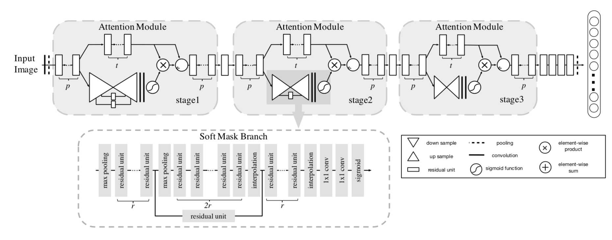

# Residual Attention Network for Image Classification
#### Author: Lichirui Zhang (lz2627), Weiwei Zhan (wz2483)

## Project Introduction
In this project, we reproduced the paper, titled [“Residual Attention Network for Image Classification”](https://arxiv.org/pdf/1704.06904.pdf) and re-implemented the Residual Attention Network which is a convolutional neural network applying the attention mechanism for image classification.


We constructed networks with different trunk layer depth and evaluated their performance on the benchmark datasets **CIFAR-10** and **CIFAR-100**. Similar to the original paper, we also 
1. tested the performance of multiple attention types on image classification; 
2. evaluated the effectiveness of attention residual learning when training very deep networks; 
3. assessed the noise resistant property of Residual Attention Network under different noise levels. 

## Experiment Implementation & Code Descriptions
### 1. Construct the Attention Residual Network
We firstly construct the Attention Residual Networks with different trunk layer depth and test them on CIFAR-10 and CIFAR-100 datasets. 
* The directory `./NoteBooks/CIFAR-10/` contains the codes that implement Attention-56, Attention-92, Attention-128, Atthention-164, and Attention-236 based on the CIFAR-10 datasets. 
* The directory `./NoteBooks/CIFAR-100/` contains the codes that implement Attention-56, Attention-92, Attention-128, and Atthention-164 based on the CIFAR-100 datasets. 

### 2. Reproduce the related experiements
We conduct extensive analysis to verify the effectiveness of our networks. 
* The directory `./NoteBooks/Different_Attentions/` contains codes that compare the performance of mixed attention, spatial attention, and channel attention.
* The directory `./NoteBooks/NAL/` contains codes that compare the effectiveness of attention residual learning (ARL) against the naive attention learning (NAL)
* The directory `./NoteBooks/Noise_Robustness/` contains codes that test the robustness of Attention-56 and ResNet-56 under 10%, 30%, 50%, and 70% noise levels

*Under all above five directories, the folder `utils/` contains core codes to define network structure, the folder `Figures/` contains figures to visualize the training process and performance of the trained model, and folder `Models/` saves the model training history*

### 3. Visualize the model performance
Finally, we visualize the comparison between our results and original paper. The codes are saved in `ReportFigure_plot.ipynb` and related figures are under `Figures/`


## Project Dependencies
* Python 3.6+
* Tensorflow 2.2.0
* Keras version: 2.3.0
* Google Cloud Platform (a single NVIDIA Tesla T4 GPU)


# Organization of this directory
```
.
├── E4040.2020Fall.LZLZ.report.lz2627.wz2483.pdf
├── Figures
│   ├── Network_structure.png
│   ├── TrainingProcess_cifar10_100.png
│   ├── results_compare_ARL_NAL.png
│   ├── results_compare_Noise_Level.png
│   └── results_compare_attention_type.png
├── NoteBooks
│   ├── CIFAR-10
│   │   ├── Figures
│   │   │   ├── ConfusionMatrix_Figures.zip
│   │   │   └── TrainingProcess_Figures.zip
│   │   ├── Models
│   │   │   └── Attention_Cifar10_traininghistory.zip
│   │   ├── Residual_Attention_128_cifar10.ipynb
│   │   ├── Residual_Attention_164_cifar10.ipynb
│   │   ├── Residual_Attention_236_cifar10.ipynb
│   │   ├── Residual_Attention_56_cifar10.ipynb
│   │   ├── Residual_Attention_92_cifar10.ipynb
│   │   └── utils
│   │       ├── models.py
│   │       └── units.py
│   ├── CIFAR-100
│   │   ├── Figures
│   │   │   └── TrainingProcess_Figures.zip
│   │   ├── Models
│   │   │   └── Attention_Cifar100_traininghistory.zip
│   │   ├── Residual_Attention_128_Cifar100.ipynb
│   │   ├── Residual_Attention_236_Cifar100.ipynb
│   │   ├── Residual_Attention_56_Cifar100.ipynb
│   │   ├── Residual_Attention_92_Cifar100.ipynb
│   │   └── utils
│   │       ├── models.py
│   │       └── units.py
│   ├── Different_Attentions
│   │   ├── Figures
│   │   │   ├── TrainingProcess_AttentionResNet56_cifar10.png
│   │   │   └── TrainingProcess_AttentionResNet56_cifar10_sa.png
│   │   ├── Models
│   │   │   └── Attention_traininghistory.zip
│   │   ├── Residual_Attention_56_channel_attention.ipynb
│   │   ├── Residual_Attention_56_sptial_attention.ipynb
│   │   └── utils
│   │       ├── models.py
│   │       └── units.py
│   ├── NAL
│   │   ├── Figures
│   │   │   ├── CofusionMatrix_Figures.zip
│   │   │   └── TrainingProcess_Figures.zip
│   │   ├── Models
│   │   │   └── Attention_NAL_traininghistory.zip
│   │   ├── Residual_Attention_128.ipynb
│   │   ├── Residual_Attention_164.ipynb
│   │   ├── Residual_Attention_236.ipynb
│   │   ├── Residual_Attention_56.ipynb
│   │   ├── Residual_Attention_92.ipynb
│   │   └── utils
│   │       ├── models.py
│   │       └── units.py
│   └── Noise_Robustness
│       ├── Figures
│       │   ├── Confusion_Matrix_Figures.zip
│       │   └── Training_Process_Figures.zip
│       ├── Models
│       │   ├── Attention56_traininghistory.zip
│       │   └── ResNet56_traininghistory.zip
│       ├── ResNet_56_Noise_Label.ipynb
│       ├── Residual_Attention_56_Noise_Label.ipynb
│       └── utils
│           ├── models.py
│           └── units.py
├── README.md
└── ReportFigure_plot.ipynb

22 directories, 51 files
```